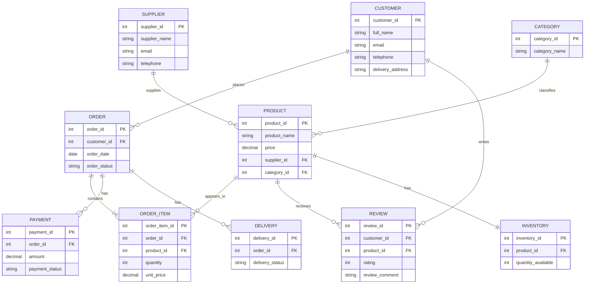

```mermaid

erDiagram
    CUSTOMER ||--o{ ORDER : places
    ORDER ||--|{ ORDER_ITEM : contains
    PRODUCT ||--o{ ORDER_ITEM : appears_in
    SUPPLIER ||--o{ PRODUCT : supplies
    CATEGORY ||--o{ PRODUCT : classifies
    ORDER ||--o{ PAYMENT : has
    ORDER ||--o{ DELIVERY : has
    CUSTOMER ||--o{ REVIEW : writes
    PRODUCT ||--o{ REVIEW : receives
    PRODUCT ||--|| INVENTORY : has

    CUSTOMER {
        int customer_id PK
        string full_name
        string email
        string telephone
        string delivery_address
    }

    SUPPLIER {
        int supplier_id PK
        string supplier_name
        string email
        string telephone
    }

    CATEGORY {
        int category_id PK
        string category_name
    }

    PRODUCT {
        int product_id PK
        string product_name
        decimal price
        int supplier_id FK
        int category_id FK
    }

    INVENTORY {
        int inventory_id PK
        int product_id FK
        int quantity_available
    }

    ORDER {
        int order_id PK
        int customer_id FK
        date order_date
        string order_status
    }

    ORDER_ITEM {
        int order_item_id PK
        int order_id FK
        int product_id FK
        int quantity
        decimal unit_price
    }

    PAYMENT {
        int payment_id PK
        int order_id FK
        decimal amount
        string payment_status
    }

    DELIVERY {
        int delivery_id PK
        int order_id FK
        string delivery_status
    }

    REVIEW {
        int review_id PK
        int customer_id FK
        int product_id FK
        int rating
        string review_comment
    }
```